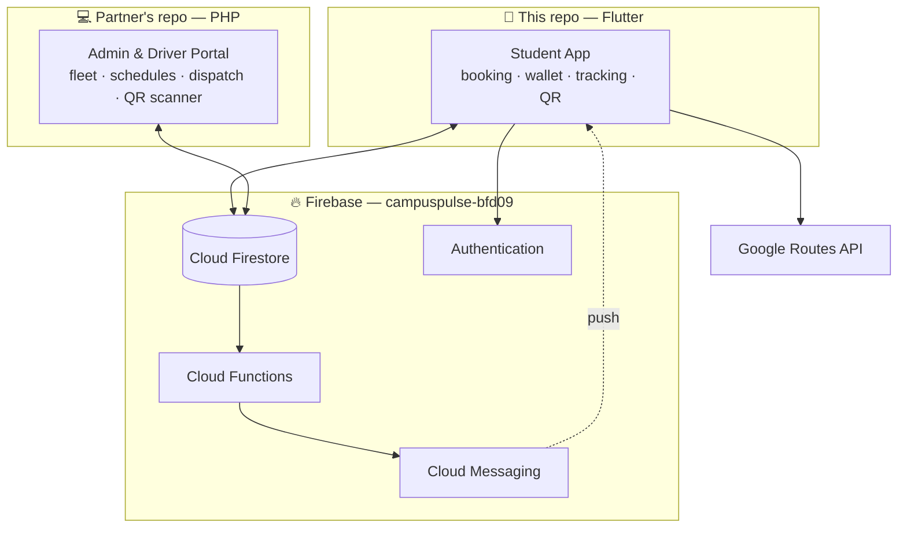

<div align="center">


**Smart shuttle booking and live tracking for UniKL students.**

Final Year Project · Universiti Kuala Lumpur

[](https://flutter.dev)
[](https://dart.dev)
[](https://firebase.google.com)
[](#)


</div>

---

## The problem

UniKL's campus shuttle ran on a printed timetable and word of mouth. Students had no
way to know whether a shuttle was running late, already full, or coming at all — so
they queued and hoped. We called this *blind waiting*, and it is the thing this project
set out to remove.

CampusPulse replaces it with two booking modes backed by live vehicle tracking:

- **Peak Hour Shuttle** — reserve a seat on a fixed departure, with the seat count
  enforced transactionally so a full shuttle cannot be oversold.
- **On-Demand Ride** — request a shuttle outside scheduled hours; the request is
  broadcast to nearby drivers and refunded automatically if nobody accepts.

---

## Features

| | |
|---|---|
| **Zone-aware booking** | Detects the student's campus zone from GPS by finding the nearest active stop within 3 km, and falls back to manual selection. |
| **Live tracking** | Google Maps view of the assigned shuttle with a road-following polyline drawn from the Google Routes API, not a straight line. |
| **QR boarding pass** | The app renders a QR ticket the driver scans to mark the student on board — the handoff point between the mobile app and the admin portal. |
| **Prepaid wallet** | Top-up, flat RM 2.00 fares, and an append-only transaction ledger. Fare deduction and booking creation happen in a single Firestore transaction. |
| **Smart Trip Planner** | Reads the student's saved class timetable and recommends the shuttle that gets them to class on time, accounting for peak hours and live traffic. |
| **Push notifications** | Driver arriving, trip started, trip completed, shuttle full, request timed out, and a reminder 30 minutes before a booked departure. |
| **Driver ratings** | Post-trip star rating with feedback tags, written once and never editable. |
| **In-app guides** | Illustrated user guide and terms/policies rendered from bundled HTML in a WebView. |

---

## Architecture

CampusPulse is two applications sharing one Firebase project. This repository is the
**student-facing mobile app**; a separate repository holds the **PHP admin and driver
portal** built by my project partner.



### Who owns booking state

Worth spelling out, because it explains most of the codebase. The mobile app is
largely a **reader** of booking state. It writes only the transitions a student
controls — timing out a `searching` request (with an automatic refund), cancelling,
and submitting a rating. Everything else (`confirmed`, `arriving`, `arrived`,
`onboard`, `completed`) is written by the driver through the PHP portal and streamed
back into the app in real time via Firestore listeners.

The QR boarding pass is where the two systems meet: the app encodes
`{"bid": <bookingId>, "name": <studentName>}`, the driver's portal scans it, and the
booking advances to `onboard`.

### Cloud Functions

Four Node.js functions in [`functions/index.js`](functions/index.js) handle everything
that has to happen without the app open:

| Function | Trigger | Purpose |
|---|---|---|
| `notifyBookingStatus` | `Bookings/{id}` updated | Pushes a notification on each status change and logs it to the student's notification centre. |
| `notifyFullShuttle` | `Schedules/{id}` updated | Alerts students when a departure reaches capacity. |
| `processAnnouncement` | `Announcements/{id}` written | Fans an admin announcement out to all students, chunked to respect FCM's 500-token limit. |
| `upcomingRideReminder` | Every 10 minutes | Reminds students 30 minutes before a confirmed departure, in Malaysia time. |

---

## Tech stack

**Client** — Flutter 3.35 / Dart 3.9, Material 3, `google_maps_flutter`, `geolocator`,
`qr_flutter`, `webview_flutter`, `flutter_local_notifications`, `flutter_dotenv`

**Backend** — Firebase Authentication, Cloud Firestore, Cloud Storage, Cloud Messaging,
Cloud Functions (Node.js 20)

**External APIs** — Google Maps SDK for Android, Google Routes API
(`directions/v2:computeRoutes`) for polylines and traffic-aware travel times

---

## Data model

Firestore collections used by the app. Full field lists are in
[`CLAUDE.md`](CLAUDE.md#5-firestore-schema).

| Collection | Holds |
|---|---|
| `Students` | Profile, wallet balance, FCM token, saved class timetable |
| `Bookings` | Every ride request and its lifecycle status |
| `Schedules` | Fixed departures with capacity (default 13) and booked seat count |
| `Routes` · `Stops` · `Zones` | Reference geography — read-only to the app |
| `Shuttles` · `Staffs` | Live vehicle position and driver details |
| `Transactions` | Append-only wallet ledger |
| `Ratings` | Post-trip driver feedback |
| `Notifications` · `Announcements` | Written by Cloud Functions and the admin portal |

A booking's `status` moves through `pending` → `searching` → `admin_review` →
`confirmed` → `arriving` → `arrived` → `onboard` → `completed`, with `expired` and
`cancelled` as terminal branches.

---

## Getting started

### Prerequisites

- Flutter SDK 3.35 or newer (`flutter doctor` should be clean)
- A Firebase project with Authentication, Firestore, Storage and Messaging enabled
- A Google Maps API key with the **Maps SDK for Android** and **Routes API** enabled
- Node.js 20+ and the Firebase CLI, if deploying Cloud Functions

### Setup

```bash
git clone https://github.com/nabilhrs/campuspulse-app.git
cd campuspulse-app
flutter pub get
```

**1. Dart-side API key.** Create a `.env` file in the project root:

```env
GOOGLE_MAPS_API_KEY=your_key_here
```

**2. Android-side API key.** Add the same key to `android/local.properties`. Gradle
reads it and injects it into the manifest as a placeholder at build time:

```properties
MAPS_API_KEY=your_key_here
```

Both files are gitignored and must never be committed. They hold the same value but
are consumed by different layers, so keep them in sync.

**3. Firebase.** Point the app at your own project:

```bash
dart pub global activate flutterfire_cli
flutterfire configure
```

This regenerates `lib/firebase_options.dart` and `android/app/google-services.json`.

**4. Run.**

```bash
flutter run
```

> On Windows, Flutter needs Developer Mode enabled to build with plugins:
> `start ms-settings:developers`

### Cloud Functions

```bash
cd functions
npm install
firebase deploy --only functions
```

---

## Project structure

```
lib/
├── core/                  App shell — splash and startup routing
├── data/services/         Non-UI services: GPS zone detection, FCM handling
├── modules/
│   ├── auth/              Registration, login, email verification
│   ├── home/              Dashboard, zone picker, profile, in-app guides
│   ├── booking/           Scheduled and on-demand booking, booking history
│   ├── wallet/            Top-up, checkout, transaction history
│   ├── tracking/          Live map, QR boarding pass, trip summary
│   ├── recommendation/    Timetable input and the Smart Trip Planner
│   ├── rating/            Post-trip driver rating
│   └── notifications/     Notification centre
├── firebase_options.dart  Generated by FlutterFire
└── main.dart

functions/                 Firebase Cloud Functions (Node.js)
assets/web/                Bundled HTML for the in-app user guide and policies
docs/                      README and design assets — not bundled into the app
```

---

## A note on committed Firebase config

`android/app/google-services.json` and `lib/firebase_options.dart` are committed on
purpose. Firebase client keys **identify** a project rather than authenticate it, and
they ship inside every APK regardless of whether they are in source control — anyone
can extract them from a released app. Google documents them as safe to include.

What actually protects the data is:

- **Firestore security rules.** A draft reconstructed from the client's access
  patterns lives in [`firestore.rules`](firestore.rules). It is *not* wired into
  `firebase.json` and must be reconciled with the console before any deploy.
- **API key restrictions.** The Maps key should be restricted in Google Cloud Console
  to the app's package name and SHA-1 fingerprint, and to only the Maps SDK and Routes
  API.

Genuine secrets — the `.env` file and `android/local.properties` — are gitignored and
have never been committed.

---

## Known limitations

Honest scope boundaries for an academic project, not oversights:

- **Android only.** iOS builds compile, but Maps is not configured on that platform
  (no `GMSServices.provideAPIKey`, no location usage strings in `Info.plist`).
- **No real payment gateway.** Wallet top-ups credit the balance directly, which is
  sufficient to demonstrate the booking and fare flow but is not production-safe.
- **Release builds use the debug keystore**, and `applicationId` is still
  `com.example.campuspulse`.
- **No automated tests.** The generated widget test was removed once it no longer
  compiled against the real app class.
- **~170 info-level analyzer results**, mostly `withOpacity` deprecations from Flutter
  SDK churn. Zero errors and zero warnings.
- **OCR timetable scanning** was prototyped with ML Kit and archived in favour of
  manual entry, which proved more reliable against UniKL's timetable layouts.

---

## Team

| Role | Scope |
|---|---|
| **[Nabil](https://github.com/nabilhrs)** | Mobile application — this repository |
| **Project partner** | Admin and driver web portal *(PHP — repository link to be added)* |

---

## Licence

Coursework submitted for a Universiti Kuala Lumpur final year project. Not licensed
for reuse or redistribution.
