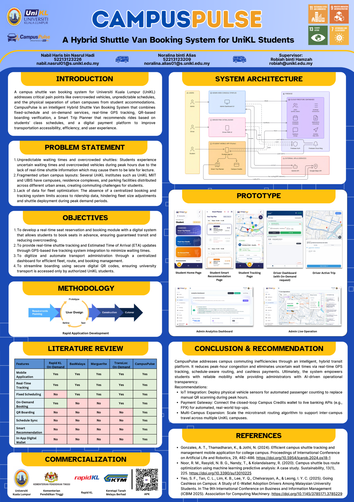
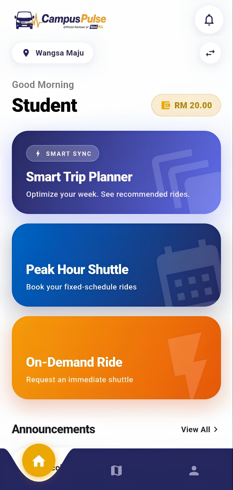
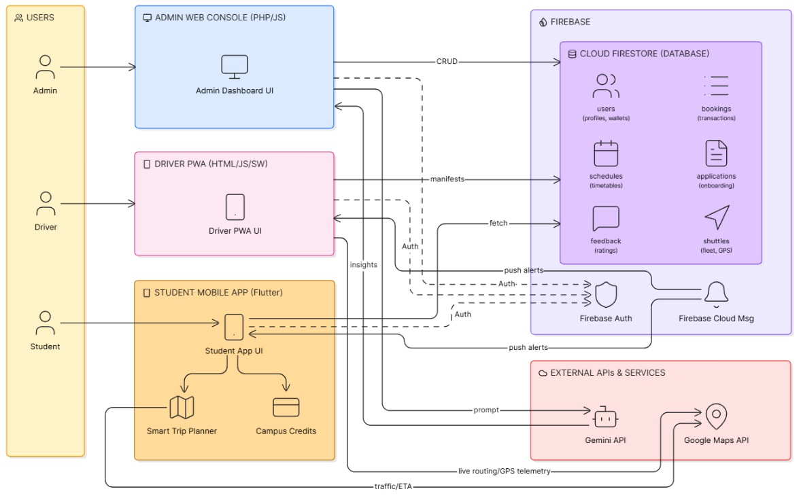

<div align="center">


**A hybrid shuttle van booking system for UniKL students.**

Final Year Project · Group 57 · Universiti Kuala Lumpur Malaysian Institute of Information Technology

[](https://flutter.dev)
[](https://dart.dev)
[](https://firebase.google.com)
[](#)

**[🌐 Live site →](https://campuspulse-xg29.onrender.com)** — the public web portal (schedules, announcements, staff and driver access),
built by [@alinaalias](https://github.com/alinaalias) in [campuspulse-web](https://github.com/alinaalias/campuspulse-web).
<sub>Hosted on a free tier, so the first visit can take up to a minute to wake up.</sub>



</div>

---

## Problem statement

Students living in UniKL's hostels — Jalan Pantai Endah, Jalan Tandok and Residensi
RAH — and those commuting from Wangsa Maju, Sentul and Kampung Baru face three
compounding problems.

**1. Absence of dedicated student transportation.** UniKL MIIT has no daily commuting
service built for the campus community. Without that infrastructure, students fall
back on private vehicles, and unknown waiting times with no real-time visibility
discourage them from public transit. The result is recurring high costs for e-hailing
or dependence on unpredictable public schedules.

**2. Inflexibility of static transport models.** Existing options run on rigid
schedules with no mechanism to switch between fixed routes at peak times and
on-demand rides off-peak. Because the transport system operates independently of the
academic timetable, students cannot align travel with classes and routinely sit
through long layovers.

**3. Real-time capacity constraints and peak-hour congestion.** Shuttle management is
a manual routine offering zero visibility into arrival times or passenger loads. This
produces "blind waiting" — commuters left behind at overcrowded stops during peak
hours, in a cycle of delays with no assurance of when a viable ride will appear.

## Objectives

1. Develop an integrated shuttle system pairing a mobile booking platform with a web
   interface, supporting hybrid ride services, secure QR boarding and comprehensive
   administrative analytics.
2. Implement real-time shuttle tracking and arrival estimation to improve
   transparency, reliability and user satisfaction in daily transportation.
3. Incorporate intelligent ride recommendation that uses students' class schedules,
   location proximity and traffic data to optimise route efficiency and travel
   planning.
4. Design a scalable hybrid booking system with intuitive interfaces that ensures
   seamless fixed or on-demand service, real-time tracking and secure passenger
   boarding.

This repository delivers the student-facing half of that system, offering two booking
modes backed by live tracking:

- **Peak Hour Shuttle** — reserve a seat on a fixed departure, with capacity enforced
  transactionally so a full van cannot be oversold.
- **On-Demand Ride** — request a van outside scheduled hours; the request is broadcast
  to nearby drivers and refunded automatically if nobody accepts.

---

## Features

| | |
|---|---|
| **Zone-aware booking** | Detects the student's zone from GPS by finding the nearest active stop within 3 km, and falls back to manual selection. |
| **Live tracking** | Google Maps view of the assigned van with a road-following polyline from the Google Routes API, not a straight line between stops. |
| **QR boarding pass** | The app renders a QR ticket the driver scans to mark the student on board — the handoff point between this app and the driver PWA. |
| **Campus Credits wallet** | Closed-loop prepaid balance with top-up, a flat RM 2.00 fare, and an append-only transaction ledger. Fare deduction and booking creation run in one Firestore transaction. |
| **Cancellation policy** | Full refund on early cancellation; cancelling within 15 minutes of departure, or once the driver is en route, incurs a 50% penalty and refunds RM 1.00. |
| **Smart Trip Planner** | Reads the student's saved class timetable and recommends the departure that gets them to class on time, accounting for peak hours and live traffic. |
| **Push notifications** | Driver arriving, trip started, trip completed, shuttle full, request timed out, and a reminder 30 minutes before a booked departure. |
| **Driver ratings** | Post-trip star rating with feedback tags, written once and never editable. |
| **In-app guides** | Illustrated user guide and terms/policies rendered from bundled HTML in a WebView. |

<div align="center">
  
</div>

---

## Architecture

CampusPulse is three applications sharing one Firebase project. This repository holds
the **student mobile app**. The **admin web console** and the **driver Progressive Web
App** live in [campuspulse-web](https://github.com/alinaalias/campuspulse-web),
built in PHP by my project partner.

<div align="center">
  
</div>

### Who owns booking state

Worth spelling out, because it explains most of the codebase. The mobile app is
largely a **reader** of booking state. It writes only the transitions a student
controls — timing out a `searching` request (with an automatic refund), cancelling,
and submitting a rating. Everything else (`confirmed`, `arriving`, `arrived`,
`onboard`, `completed`) is written by the driver PWA or admin console and streamed
back into the app in real time through Firestore listeners.

The QR boarding pass is where the systems meet: the app encodes
`{"bid": <bookingId>, "name": <studentName>}`, the driver's PWA scans it, and the
booking advances to `onboard`.

### Cloud Functions

Four Node.js functions in [`functions/index.js`](functions/index.js) handle everything
that has to happen without the app open:

| Function | Trigger | Purpose |
|---|---|---|
| `notifyBookingStatus` | `Bookings/{id}` updated | Pushes a notification on each status change and logs it to the student's notification centre. |
| `notifyFullShuttle` | `Schedules/{id}` updated | Alerts students when a departure reaches capacity. |
| `processAnnouncement` | `Announcements/{id}` written | Fans an admin announcement out to all students, chunked to respect FCM's 500-token limit. |
| `upcomingRideReminder` | Every 10 minutes | Reminds students 30 minutes before a confirmed departure, in Malaysia time. |

---

## Tech stack

**Client** — Flutter 3.35 / Dart 3.9, Material 3, `google_maps_flutter`, `geolocator`,
`qr_flutter`, `webview_flutter`, `flutter_local_notifications`, `flutter_dotenv`

**Backend** — Firebase Authentication, Cloud Firestore, Cloud Storage, Cloud Messaging,
Cloud Functions (Node.js)

**External APIs** — Google Maps SDK for Android, Google Routes API
(`directions/v2:computeRoutes`) for polylines and traffic-aware travel times

The web half additionally uses PHP 8.2, service workers for the driver PWA, and the
Google Gemini API to power an AI analyst over fleet and ratings data.

---

## Data model

Firestore collections **as used by this app**. The wider system also writes fields
consumed only by the web portal — `ticket_status`, `check_in_time`, `onboard_count`,
`duty_status` and the `DRIVER_APPLICATIONS` collection among them. Full field lists
for the mobile view are in [`docs/DATA_MODEL.md`](docs/DATA_MODEL.md).

| Collection | Holds |
|---|---|
| `Students` | Profile, Campus Credits balance, FCM token, saved class timetable |
| `Bookings` | Every ride request and its lifecycle status |
| `Schedules` | Fixed departures with seat capacity and booked count |
| `Routes` · `Stops` · `Zones` | Reference geography — read-only to the app |
| `Shuttles` · `Staffs` | Live vehicle position and driver details |
| `Transactions` | Append-only Campus Credits ledger |
| `Ratings` | Post-trip driver feedback |
| `Notifications` · `Announcements` | Written by Cloud Functions and the admin console |

A booking's `status` moves through `pending` → `searching` → `admin_review` →
`confirmed` → `arriving` → `arrived` → `onboard` → `completed`, with `expired` and
`cancelled` as terminal branches.

---

## Getting started

### Prerequisites

- Flutter SDK 3.35 or newer (`flutter doctor` should be clean)
- A Firebase project with Authentication, Firestore, Storage and Messaging enabled
- A Google Maps API key with the **Maps SDK for Android** and **Routes API** enabled
- Node.js 20+ and the Firebase CLI, if deploying Cloud Functions

### Setup

```bash
git clone https://github.com/nabilhrs/campuspulse-app.git
cd campuspulse-app
flutter pub get
```

**1. Dart-side API key.** Create a `.env` file in the project root:

```env
GOOGLE_MAPS_API_KEY=your_key_here
```

**2. Android-side API key.** Add the same key to `android/local.properties`. Gradle
reads it and injects it into the manifest as a placeholder at build time:

```properties
MAPS_API_KEY=your_key_here
```

Both files are gitignored and must never be committed. They hold the same value but
are consumed by different layers, so keep them in sync.

**3. Firebase.** Point the app at your own project:

```bash
dart pub global activate flutterfire_cli
flutterfire configure
```

This regenerates `lib/firebase_options.dart` and `android/app/google-services.json`.

**4. Run.**

```bash
flutter run
```

> On Windows, Flutter needs Developer Mode enabled to build with plugins:
> `start ms-settings:developers`

### Cloud Functions

```bash
cd functions
npm install
firebase deploy --only functions
```

---

## Project structure

```
lib/
├── core/                  App shell — splash and startup routing
├── data/services/         Non-UI services: GPS zone detection, FCM handling
├── modules/
│   ├── auth/              Registration, login, email verification
│   ├── home/              Dashboard, zone picker, profile, in-app guides
│   ├── booking/           Scheduled and on-demand booking, booking history
│   ├── wallet/            Top-up, checkout, transaction history
│   ├── tracking/          Live map, QR boarding pass, trip summary
│   ├── recommendation/    Timetable input and the Smart Trip Planner
│   ├── rating/            Post-trip driver rating
│   └── notifications/     Notification centre
├── firebase_options.dart  Generated by FlutterFire
└── main.dart

functions/                 Firebase Cloud Functions (Node.js)
assets/web/                Bundled HTML for the in-app user guide and policies
docs/                      README and design assets — not bundled into the app
```

---

## A note on committed Firebase config

`android/app/google-services.json` and `lib/firebase_options.dart` are committed on
purpose. Firebase client keys **identify** a project rather than authenticate it, and
they ship inside every APK regardless of whether they are in source control — anyone
can extract them from a released app. Google documents them as safe to include.

What actually protects the data is:

- **Firestore security rules** in [`firestore.rules`](firestore.rules). Verified
  `@s.unikl.edu.my` students can read and change only their own profile, bookings,
  ledger and notifications, and can move a booking only through student-driven
  states. The driver PWA's in-browser code doesn't sign in, so it gets exactly the
  reads and live-trip fields it uses. Staff records, including password hashes, are
  never public. The file's header lists the limitations that need code changes
  rather than rule changes. Deploy with `firebase deploy --only firestore:rules`.
- **API key restrictions.** The Maps key should be restricted in Google Cloud Console
  to the app's package name and SHA-1 fingerprint, and to only the Maps SDK and Routes
  API.

Genuine secrets — the `.env` file and `android/local.properties` — are gitignored and
have never been committed.

---

## Development and testing

Built with **Rapid Application Development**, using iterative prototyping so the
system could absorb changing stakeholder requirements across each cycle.

User Acceptance Testing was run with **30 respondents** — 20 UniKL MIIT students,
7 active shuttle drivers and 3 administrative staff — covering all three subsystems.
Test cases, questionnaire results and the full methodology are documented in the
project report.

---

## Known limitations

Honest scope boundaries for an academic project, not oversights:

- **Android only.** iOS builds compile, but Maps is not configured on that platform
  (no `GMSServices.provideAPIKey`, no location usage strings in `Info.plist`).
- **Campus Credits are simulated.** Top-ups credit the balance directly. A production
  deployment would connect the wallet to a payment gateway such as FPX or Billplz.
- **Release builds use the debug keystore**, and `applicationId` is still
  `com.example.campuspulse`.
- **No automated tests.** The generated widget test was removed once it no longer
  compiled against the real app class.
- **~170 info-level analyzer results**, mostly `withOpacity` deprecations from Flutter
  SDK churn. Zero errors and zero warnings.
- **OCR timetable scanning** was prototyped with ML Kit and archived in favour of
  manual entry, which proved more reliable against UniKL's timetable layouts.
- **Single campus.** Routes and zones are modelled for UniKL MIIT; multi-campus
  support would need a multi-tenant data model.
- **Individual bookings only.** Group booking, so friends are placed on the same van,
  is identified as future work.

---

## Team

Group 57 · Bachelor of Software Engineering with Honours ·
Universiti Kuala Lumpur Malaysian Institute of Information Technology (UniKL MIIT) ·
March 2026

| Member | Scope |
|---|---|
| **Nabil Haris bin Nasrul Hadi** · [@nabilhrs](https://github.com/nabilhrs) | Student mobile application — this repository |
| **Noralina binti Alias** · [@alinaalias](https://github.com/alinaalias) | Admin web console and driver PWA — [campuspulse-web](https://github.com/alinaalias/campuspulse-web) |

Supervised by Madam Robiah binti Hamzah. Assessed by Dr. Suriana binti Ismail.

---

## Licence

Coursework submitted for a Universiti Kuala Lumpur final year project. Not licensed
for reuse or redistribution.
